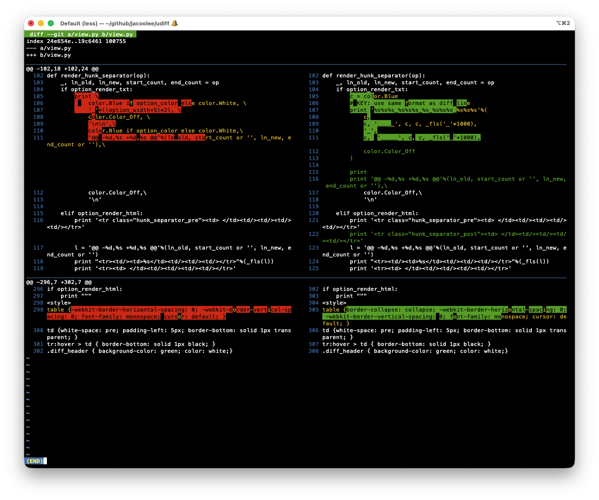
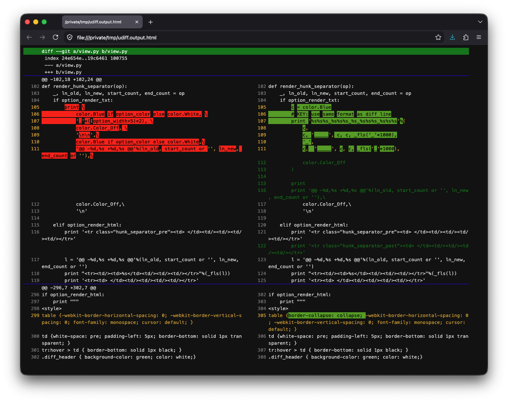

# Udiff - View diff content side by side





```
~/github/jacoolee/udiff $ udiff 36531bd f8e784f
~/github/jacoolee/udiff $ ENV_HTML=1 udiff 36531bd f8e784f > /tmp/x.html; open /tmp/x.html
```

---

## Run directly

```
$ ./udiff
```

## Put udiff directoy path in $PATH

```
$ export PATH=$PATH:{YOUR_UDIFF_DIRECTORY_PATH}
$ udiff
```

## Use aliases in ~/.bashrc

```
alias d=udiff
alias D='ENV_HTML=1 udiff > /tmp/x.html; open /tmp/x.html'
```

## View git log

```
$ git log
COMMIT_ID_C hello
COMMIT_ID_B some modify here
COMMIT_ID_A init

$ udiff COMMIT_ID_A COMMIT_ID_B
$ ENV_HTML=1 udiff COMMIT_ID_A COMMIT_ID_B
```

## View any diff content

Check out [./example](./example)

## Recommands

[https://github.com/ymattw/ydiff](https://github.com/ymattw/ydiff)
